# 🛒 Customer Segmentation & RFM Analysis (SQL)

---

## Project Overview
This project performs a **comprehensive sales data analysis** using SQL.  
It includes **data inspection, sales insights, customer segmentation using RFM, and market basket analysis**.

---

## 💎 RFM Analysis

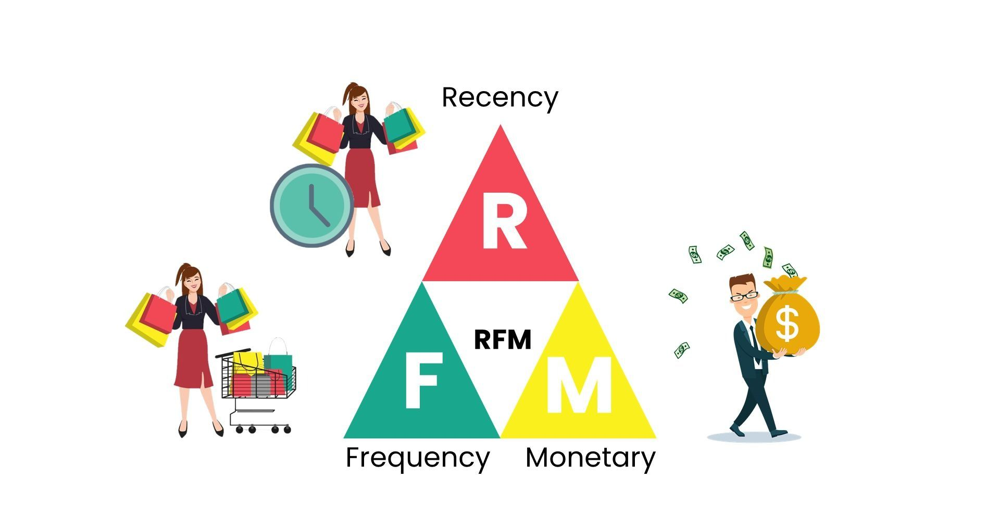

RFM is a **data modeling method used to analyze customer value**.  
It stands for **Recency, Frequency, and Monetary**, which are the three metrics that describe customers.  
It is an **indexing technique that uses past purchase behavior to segment customers**.

- **Recency:** Last Order Date  
- **Frequency:** Count of Total Orders  
- **Monetary:** Total Money Spent

Using these metrics, customers are grouped into segments like **Loyal, Active, Slipping Away, and Lost Customers**.  
This analysis helps identify **top customers and potential churners**.

---

## 📊 Dataset Preview
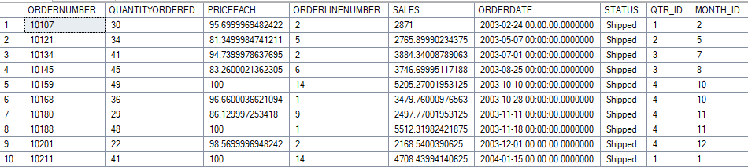  
*First few rows of the sales dataset showing structure and columns.*

---

## 🔍 Unique Values
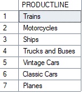  
*Distinct values for key columns like COUNTRY, PRODUCTLINE, DEALSIZE, STATUS.*

---

## 🌎 Revenue by Country
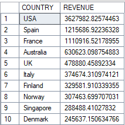  
*Shows which countries generate the most revenue.*

---

## 🏙 Revenue by City (USA)
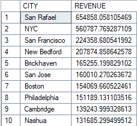  
*Breakdown of revenue by city within the USA.*

---

## 🏷 Sales by Product Line
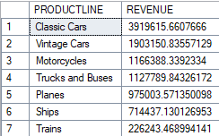  
*Revenue contribution of each product line.*

---

## 📈 Sales by Year
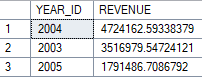  
*Trend of total sales over the years.*

---

## 🥇 Best Product in USA
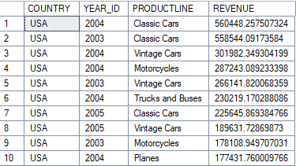  
*Identifies the top-selling product line in the USA.*

---

## 📅 Best Month Sales
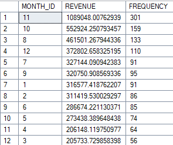  
*Shows the month with the highest sales and order frequency.*

---

## 👤 Customer RFM – Basic Metrics
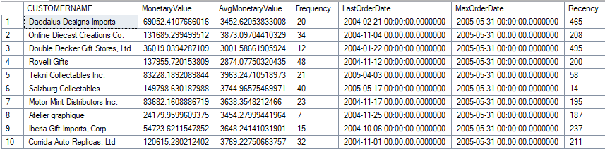  
*Monetary value, frequency, and recency per customer.*

---

## 💎 Customer RFM – Scores & Segmentation
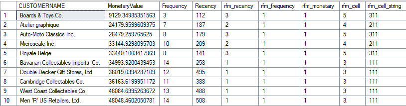  
*RFM scores (`rfm_recency`, `rfm_frequency`, `rfm_monetary`), cell values, and segmentation.*

---

## 🛍 Products Most Often Sold Together
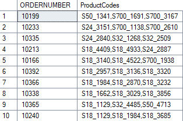  
*Market basket analysis showing products frequently bought together.*

---

## 📚 Learnings
- Learned how to perform **RFM analysis using SQL**  
- Understood **sales trends by country, city, product, and year**  
- Practiced **market basket analysis for product combinations**  
- Gained experience in **structuring a portfolio-ready SQL project**

---

## 📝 Notes
- Temporary tables (`#rfm`) help manage intermediate calculations  
- Visuals (PNGs) make the analysis **portfolio-friendly**  
- Focus on **top customers / top orders** for clean presentation  
- Ensure columns like `rfm_recency`, `rfm_frequency`, `rfm_monetary`, and `ProductCodes` are **fully visible** in screenshots  

---

## 💬 Feedback

If you have any feedback or suggestions, feel free to connect with me.

LinkedIn:  
https://www.linkedin.com/in/hrishikeshmurudkar-data/

---

## 👨‍💻 Author

**Hrishikesh Murudkar**  
Aspiring Data Analyst  

GitHub:  
https://github.com/hrishikeshmurudkar-data
